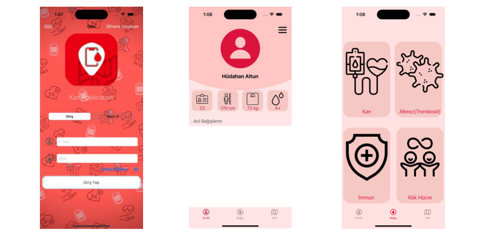
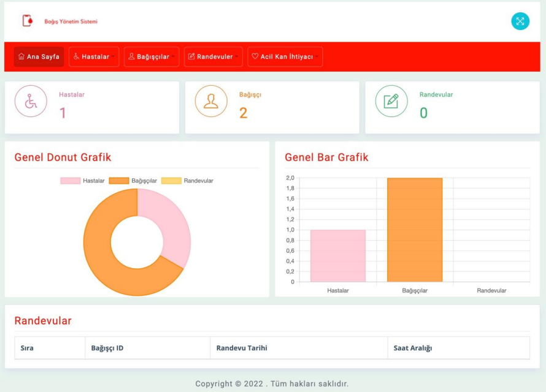

# Blood Donation Mobile Application and Website

## Overview

This project aims to develop a mobile application and a website that can facilitate and promote blood donations. The project was completed as part of the Software Engineering course at Karadeniz Technical University.

## Problem Statement

There is a critical need for an efficient system to manage and promote blood donations, especially in emergency situations. Current systems are not user-friendly and do not effectively engage potential donors.

## Solution and Methods

We developed a mobile application and a website that work together to streamline the blood donation process. The mobile app is designed for donors, while the website is intended for hospital use.

### Features

1. **User Registration and Profile Management:** Users can register and manage their profiles, including viewing their donation history.
2. **Blood Donation Requests:** Users can see urgent blood donation requests and navigate to donation centers.
3. **Donor Management:** Hospitals can manage donor information and add new donors through the website.
4. **Real-time Notifications:** The system sends real-time notifications to users about urgent blood needs using Firestore.

### Innovative Approaches

The project includes a unique protocol named AKYS, which integrates hospital systems with the mobile application. This protocol ensures real-time updates and notifications about urgent blood needs.

### Technical Details

- **Mobile Application:** Developed using Swift, following the MVC architecture.
- **Website:** Developed using Django, integrated with Firestore for real-time data management.
- **Database:** Firebase Firestore was chosen for its real-time capabilities and ease of integration with both mobile and web platforms.

## System Requirements

The project adheres to the initial requirements analysis with some updates and enhancements to improve functionality and user experience.

### Requirements Analysis Updates

- **Dynamic Data Visualization:** The website includes dynamic graphs to display data from the database.
- **Enhanced User Interface:** Both the mobile app and the website have user-friendly interfaces for easy navigation and usage.

## Architecture Analysis Updates

The project architecture was updated to accommodate real-time data requirements and improve system performance.

## Screenshots
  
  

### Contributions

- **Mobile Application Development:** Hüdahan Altun
- **Website and Database Development:** Osman Can Aksoy, Ufuk Bulut

## License

This project is licensed under the MIT License. See the [LICENSE](LICENSE) file for details.
